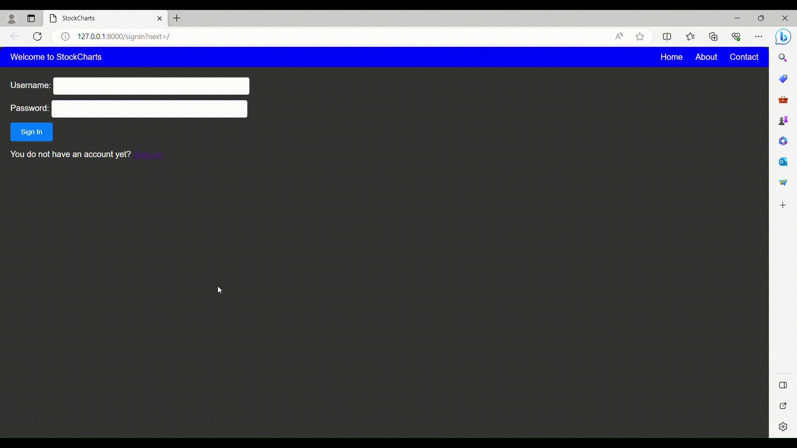
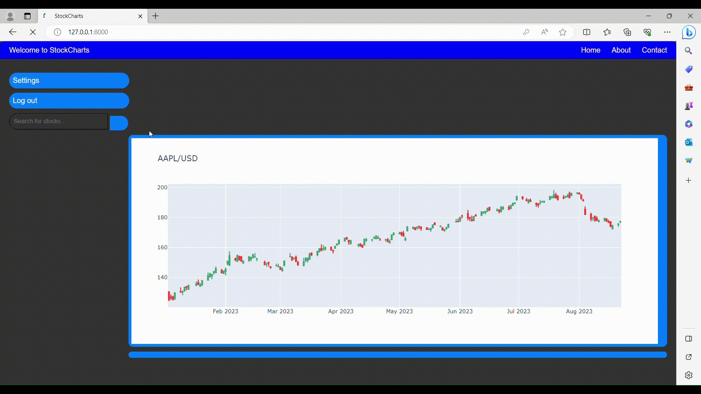
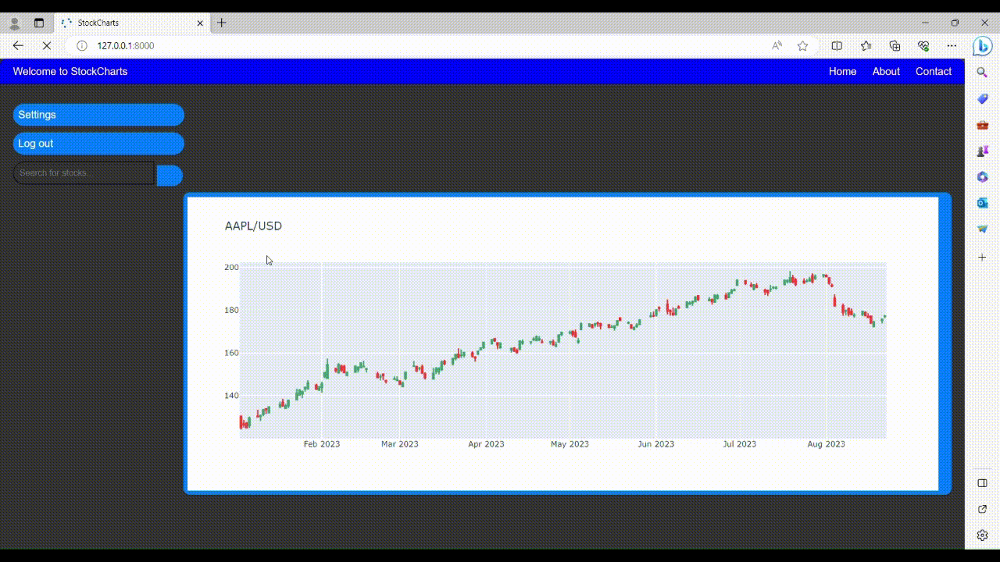

# StockCharts Django Project

StockCharts is a web application built using Django that allows users to create accounts, manage settings, search for stocks, follow or unfollow stocks of interest, view candlestick charts, and access financial data of various companies!

## Features 
(Note: The GIFs may appear dotted here, but it displays smoothly in reality.)
- **User Authentication**: Users can create accounts, log in, and manage their profiles.
  

    
  

- **Settings**: Users can modify their account settings, such as profile information and preferences.
  

    
  

- **Stock Search**: Users can search for stocks based on company names or symbols.
  

    
  

- **Stock Following**: Users can follow or unfollow stocks to create a personalized feed.
  

    
  

- **Home Page Feed**: The home page displays a feed of candlestick charts for followed stocks.
  

    
  
 
- **Candlestick Charts**: Users can view candlestick charts for selected stocks. They can input start date, end date, and interval for chart customization.
  

    
  

- **Company Information & Financial Data**: Users can see basic company information and latest financial data
  

    
  

## Usage
- Log in or create an account.
- Modify your account settings if desired.
- Search for stocks by company name or symbol.
- Click on a stock to access detailed information, including financial data.
- View and customize candlestick charts by inputting start date, end date and interval.
- Follow or unfollow stocks to customize your feed.
- View candlestick charts on your home page.

## License
This project is licensed under the MIT License - see the [LICENSE](LICENSE.txt) file for details.

## Contact
mail: mikolajczachorowski260203@gmail.com
